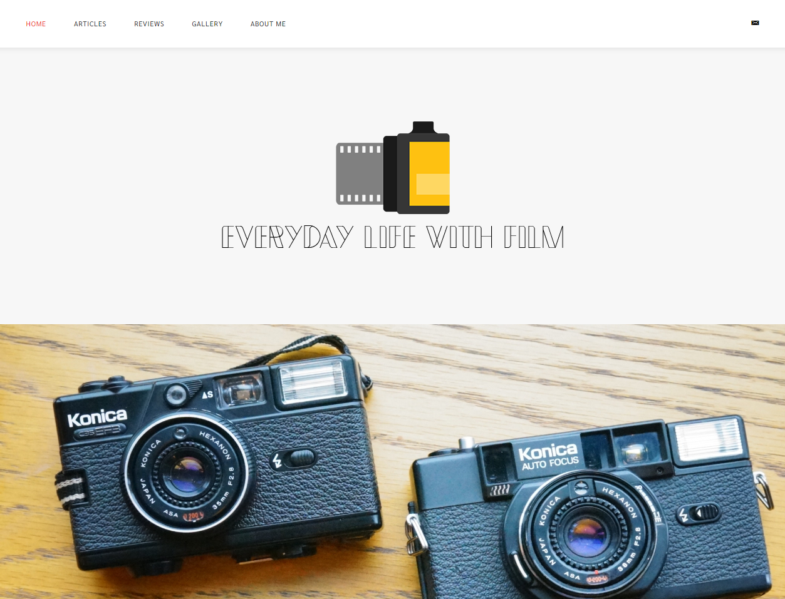
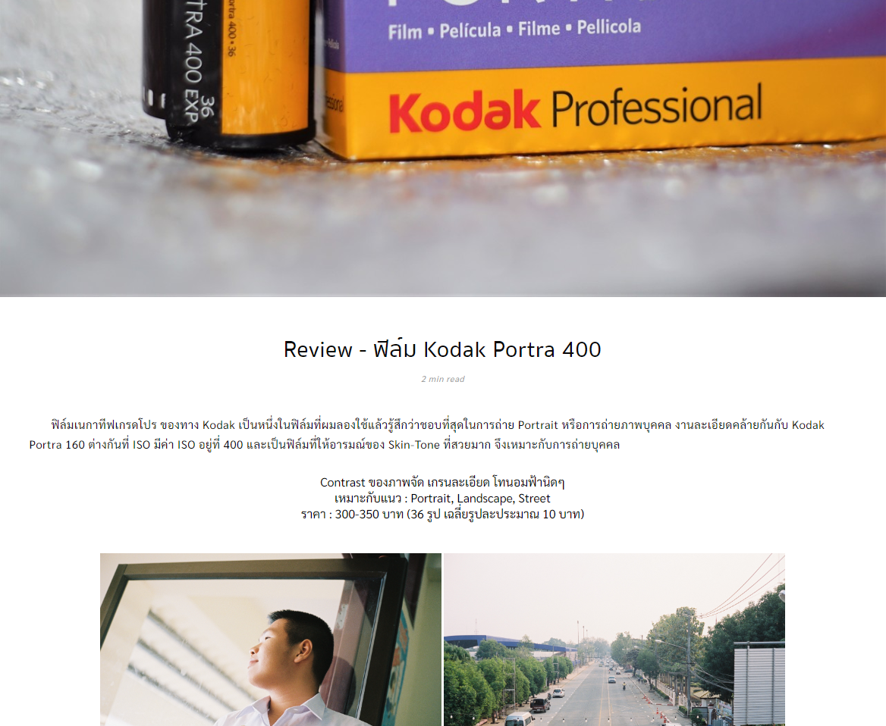
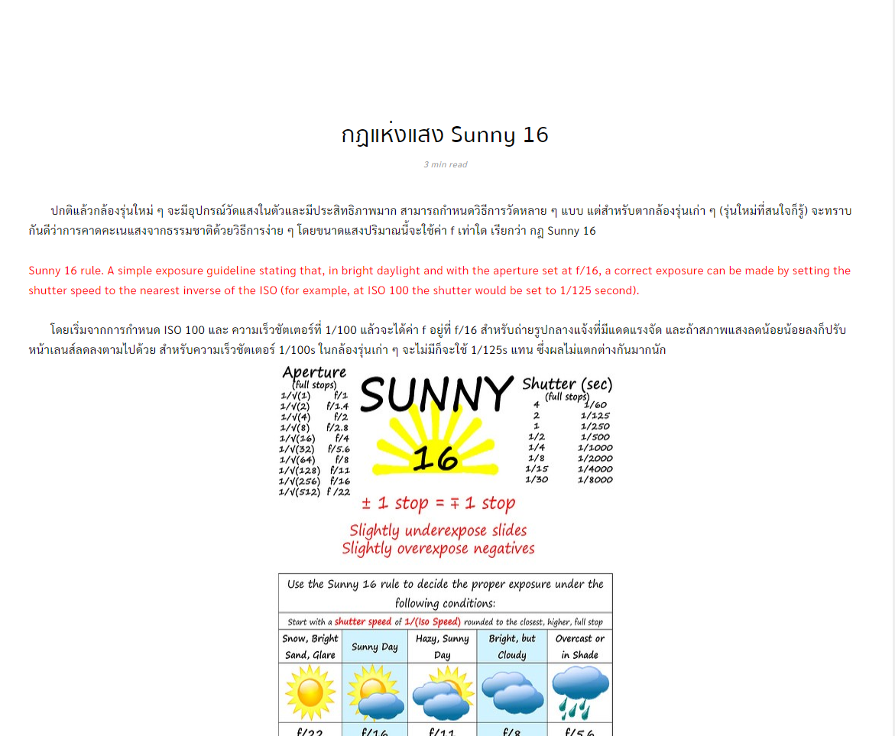
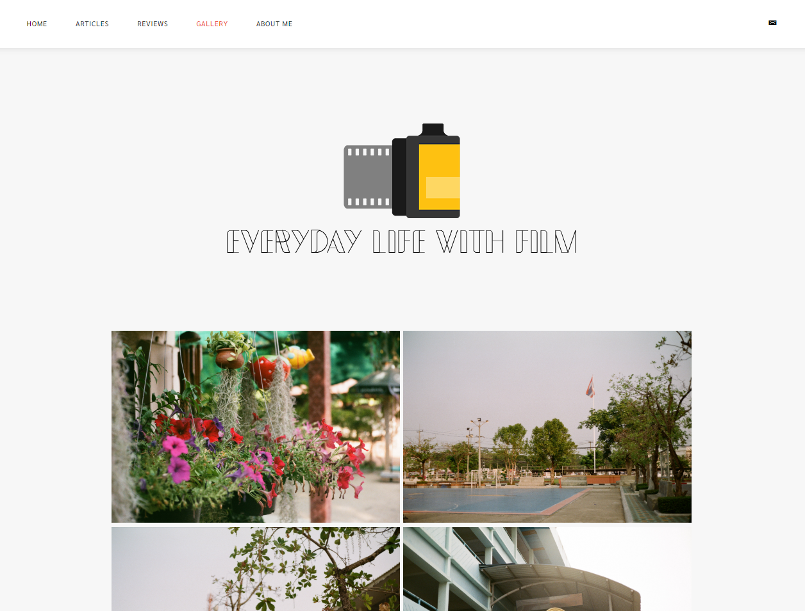

  
  <h3 align="center">EverydayLifewithFilm Website Project</h3>
  

    Web Blog for Education Purpose, Developed by Uttaradit School Student
     
    <a href="https://utd.ac.th/" target="_blank"><strong>Uttaradit School »</strong></a> 
  

# About the Project
This website is made for education purpose on computer sciences project. 
Made by Peerawit Pharkdeepinyo.

## Screenshots

